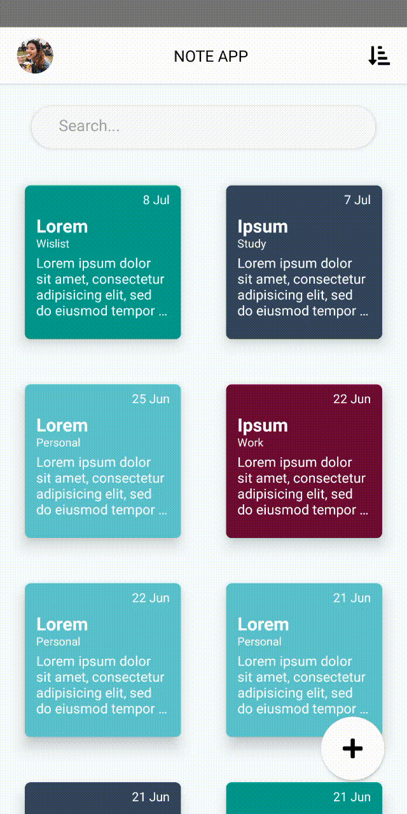
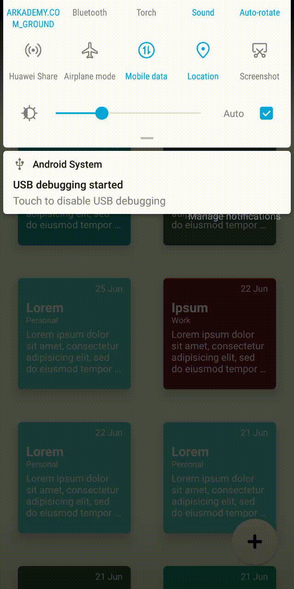
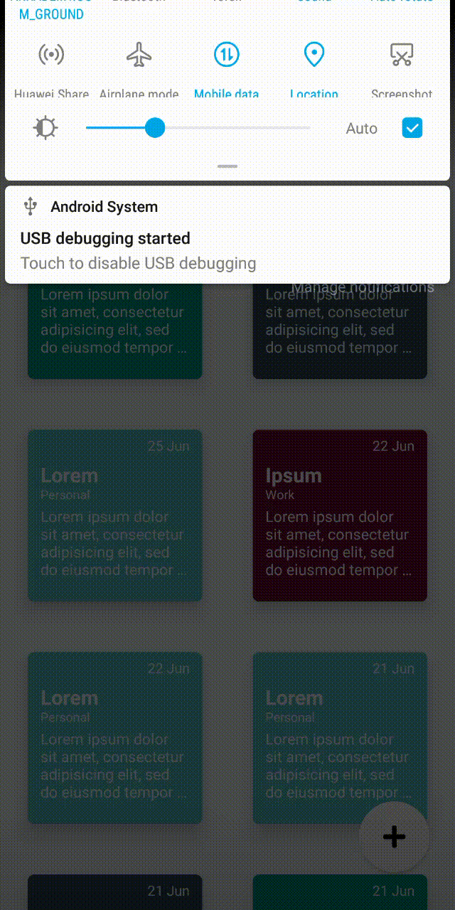
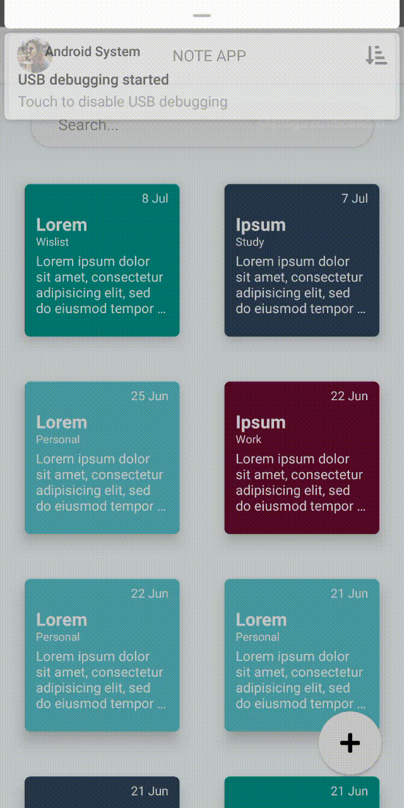

# API App · RESTful API

A clean, simple note‑taking app built with **React Native** and a **Node/Express REST API**. Create, search, sort, update, and organize notes by category — all from a fast, native UI.

<p align="left">
  <a href="https://facebook.github.io/react-native/"></a>
  <a href="https://nodejs.org/"></a>
  
  
</p>

---

## Table of Contents

* [Features](#features)
* [Architecture](#architecture)
* [Requirements](#requirements)
* [Quick Start](#quick-start)
* [Configuration](#configuration)
* [Available Scripts](#available-scripts)
* [REST API (overview)](#rest-api-overview)
* [Project Structure](#project-structure)
* [Demonstration](#demonstration)
* [Troubleshooting](#troubleshooting)
* [Contributing](#contributing)
* [License](#license)

---

## Features

* ✍️ Create, edit, and delete notes
* 🗂️ Categories for quick filtering
* 🔍 Search notes
* ↕️ Sort ascending/descending
* ⚡ Smooth, native interactions (no webviews)
* 🔗 Clean Redux action structure for API calls

## Architecture

React Native front‑end using Redux for state management, talking to a Node/Express REST API. UI components are fully native; data is persisted through the backend.

> **How React Native works**: React Native bridges JS to native platform APIs (Objective‑C on iOS, Java/Kotlin on Android) to render real native views — not web views.

---

## Requirements

* **Node.js** & **npm**
* **React Native CLI** (or use `npx`)
* Android device/emulator with USB debugging enabled (or iOS Simulator on macOS)

---

## Quick Start

1. **Clone** the repository
2. **Install** dependencies:

   ```bash
   npm install
   ```
3. **Configure API base URL** (see [Configuration](#configuration))
4. **Run the app**

   * Using RN CLI (as originally used in this project):

     ```bash
     react-native run-android
     ```
   * Or with `npx` (recommended):

     ```bash
     npx react-native run-android
     # or
     npx react-native run-ios
     ```

> Ensure a device/emulator is connected and USB debugging is enabled.

---

## Configuration

Update the backend IP/host used by Redux actions:

* **File**: `src/Public/redux/actions/notes.js`
* **What to change**: the **API base URL** (IP of your backend server)

```js
// example
export const API_BASE_URL = "http://192.168.1.20:8000"; // <-- change to your backend IP
```

> 💡 Tip: Consider moving this to an `.env` file and loading via a config helper so you don’t hard‑code IPs.

---

## Available Scripts

```bash
# install deps
npm install

# Android (device or emulator)
react-native run-android
# or
npx react-native run-android

# iOS (macOS only)
npx pod-install ios
npx react-native run-ios

# start Metro bundler
npx react-native start
```

---

## REST API (overview)

> Minimal overview of expected endpoints used by the app (your backend may vary).

**Notes**

* `GET /notes` — list notes
* `POST /notes` — create
* `GET /notes/:id` — detail
* `PATCH /notes/:id` — update
* `DELETE /notes/:id` — delete

**Categories**

* `GET /categories`
* `POST /categories`
* `PATCH /categories/:id`
* `DELETE /categories/:id`

**Note payload example**

```json
{
  "id": 42,
  "title": "Grocery list",
  "content": "Eggs, milk, spinach",
  "categoryId": 3,
  "createdAt": "2025-08-12T18:30:00Z",
  "updatedAt": "2025-08-12T19:05:00Z"
}
```

---

## Project Structure

```
src/
  Assets/
    DummyData/
      scrolling.gif
      sort.gif
      search.gif
      sortbycategory.gif
      insertdeletecategory.gif
      updatenote.gif
      insertdeletenote.gif
  Public/
    redux/
      actions/
        notes.js         # <-- API base URL lives here
```

---

## Demonstration

| Home (scroll)                                               | Sort (Asc/Desc)                                        | Search                                                   |
| ----------------------------------------------------------- | ------------------------------------------------------ | -------------------------------------------------------- |
|  |  |  |

| Sort by Category                                                 | Insert/Delete **Category**                                             | Update Note                                                  | Insert/Delete **Note**                                             |
| ---------------------------------------------------------------- | ---------------------------------------------------------------------- | ------------------------------------------------------------ | ------------------------------------------------------------------ |
|  |  |  |  |

> On GitHub the GIFs will auto‑play. Adjust widths as you prefer.

---

## Troubleshooting

* **Couldn’t connect to server**: verify API base URL (IP) in `notes.js`, ensure backend is running and reachable from your device (same network).
* **Android build fails**: try `cd android && ./gradlew clean`, then rebuild. Ensure Java SDK and Android SDK paths are properly set.
* **iOS pods**: run `npx pod-install` in the project root (or `cd ios && pod install`).
* **Metro bundler stuck**: clear cache with `npx react-native start --reset-cache`.

---

## Contributing

PRs and issues are welcome. Please follow conventional commit messages where possible and keep PRs focused.

## License

MIT — see `LICENSE` for details.
